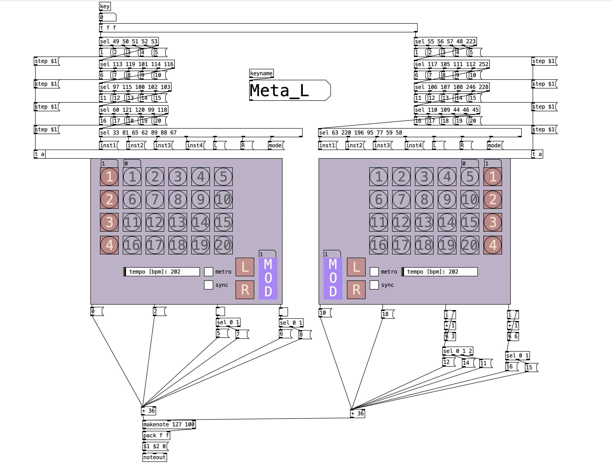

# fulgur
Keyboard-controlled non-power-of-too step sequencer in Pure Data 

# Quick intro
Fulgur is a non-power-of-too step sequencer in Pure Data that you control with your keyboard. It has 8 individual tracks/voices with max. 20 steps each.
You can enter which steps to select with the following layout (uses the German keyboard):

 

|LEFT:   |RIGHT:   |
|---|---|
|12345   |7890ß   |
|qwert   |uiopü   |
|asdfg   |jklöä   |
|<yxcv   |nm,.-   |

You can switch instruments by selecting Shift + (1/q/a/<) for the left and Shift (ß/ü/ä/-) for the right.

YOU CAN CHANGE ALL OF THESE ONCE YOU OPEN THE PATCH CALLED "keyboard.pd"! Simply look at which key has which number and change them in the select structure on the top of the page.
[step $1< is the according step, [inst1< and so on select a new instrument.

[L</[R< (which for me are activated with Shift + y/x (left) and Shift + m/) have the ability to disable steps from the left or the right.
If you disable the last two steps of the first row, the pointer will jump to the second row on the fourth beat.
This will lead the instrument you are currently on to go out of sync with the others, which can lead to some super cool polymeters.

CAVEAT:
For now, please do not think too hard about the [mode< message, I want to use it to create some automation in the future, but for now it is only useful to instantly turn off/on one of the hands, which can be cool as well.

Definitely let me know if you make some cool music with it!

Inspirations:
- Some monome norns / grid step sequencers patches I saw on YouTube (will link them when I find them again!)
